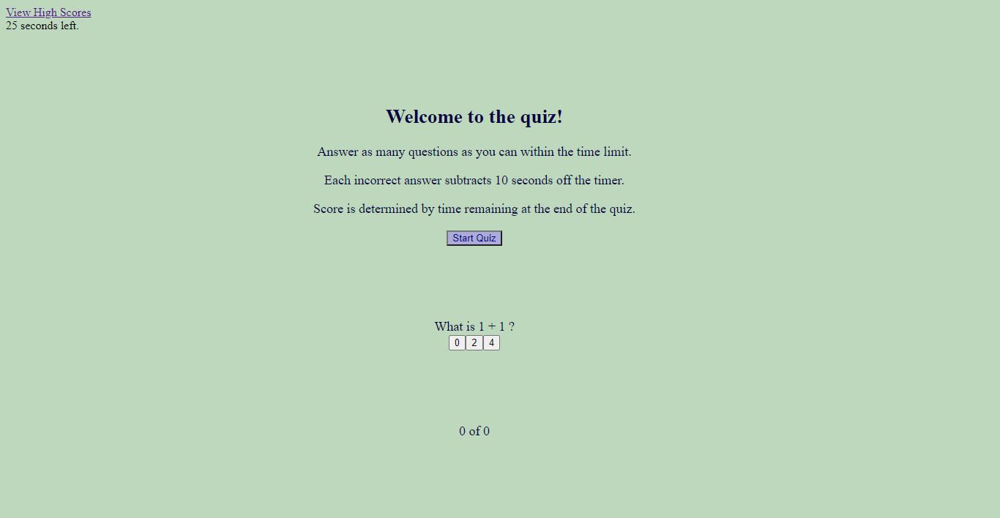

# Javscript Timed Quiz

## Description 
A timed quiz application. Incorrect answers subtract time from the clock. Score is determined by time remaining.

Published at: https://litabeach.github.io/Timed-Quiz-Application/

## Table of Contents

* [Usage](#usage)
* [Credits](#credits)
* [License](#license)

## Usage 

Click "start quiz" button to begin the quiz. Select answers from multiple choices. The quiz is completed when all questions are answered or the timer has run out, whichever occurs first. Input your intials to save your score and intials.

## Credits

Hannah Folk  
Nathan Perfetti  
Blake Drogos  
https://www.sitepoint.com/simple-javascript-quiz/  
https://stackoverflow.com/questions/11969412/how-do-i-make-a-loop-advance-using-onclick

## Copyright

Copyright 2020 Lita Beach

Permission is hereby granted, free of charge, to any person obtaining a copy of this software and associated documentation files (the "Software"), to deal in the Software without restriction, including without limitation the rights to use, copy, modify, merge, publish, distribute, sublicense, and/or sell copies of the Software, and to permit persons to whom the Software is furnished to do so, subject to the following conditions:

The above copyright notice and this permission notice shall be included in all copies or substantial portions of the Software.

THE SOFTWARE IS PROVIDED "AS IS", WITHOUT WARRANTY OF ANY KIND, EXPRESS OR IMPLIED, INCLUDING BUT NOT LIMITED TO THE WARRANTIES OF MERCHANTABILITY, FITNESS FOR A PARTICULAR PURPOSE AND NONINFRINGEMENT. IN NO EVENT SHALL THE AUTHORS OR COPYRIGHT HOLDERS BE LIABLE FOR ANY CLAIM, DAMAGES OR OTHER LIABILITY, WHETHER IN AN ACTION OF CONTRACT, TORT OR OTHERWISE, ARISING FROM, OUT OF OR IN CONNECTION WITH THE SOFTWARE OR THE USE OR OTHER DEALINGS IN THE SOFTWARE.

## Badges

